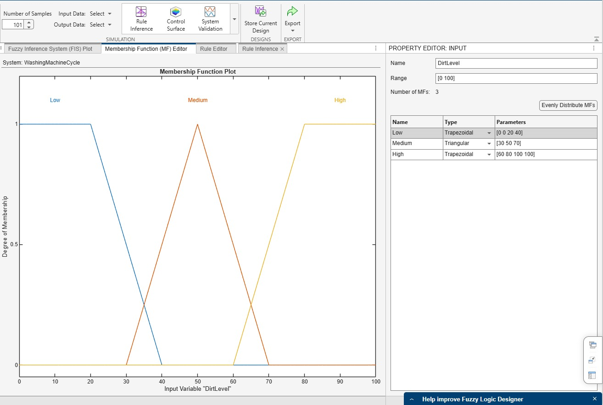
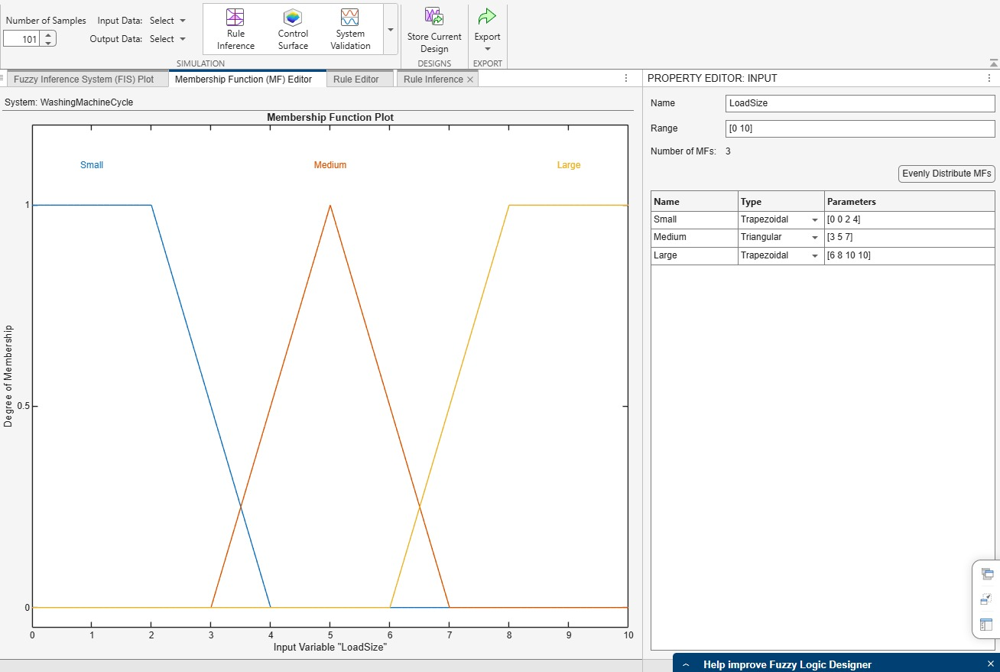
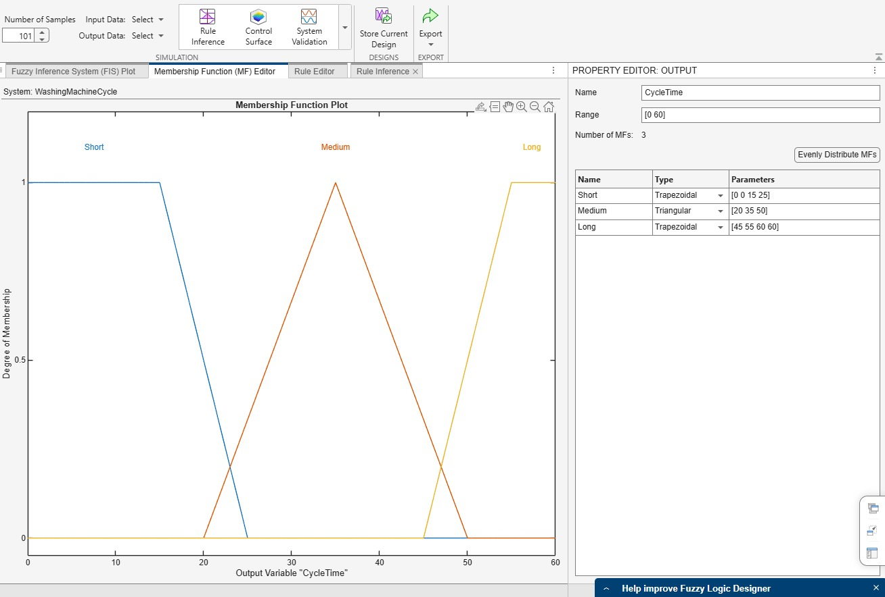
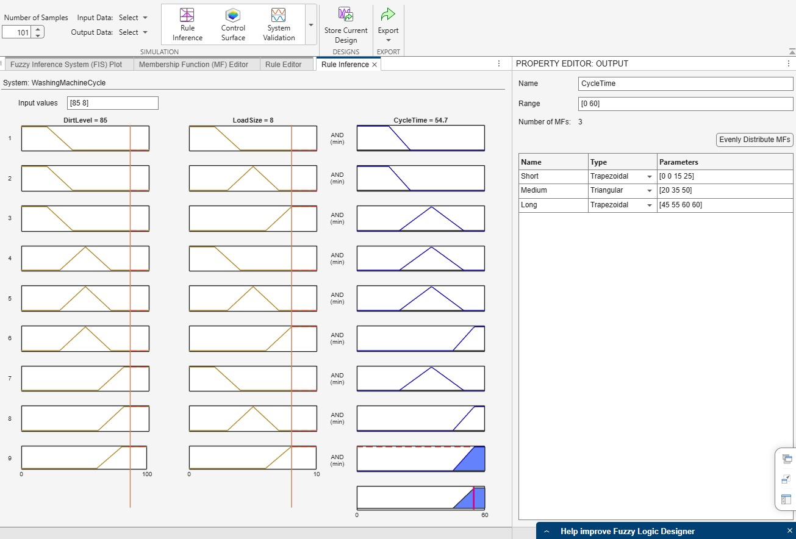
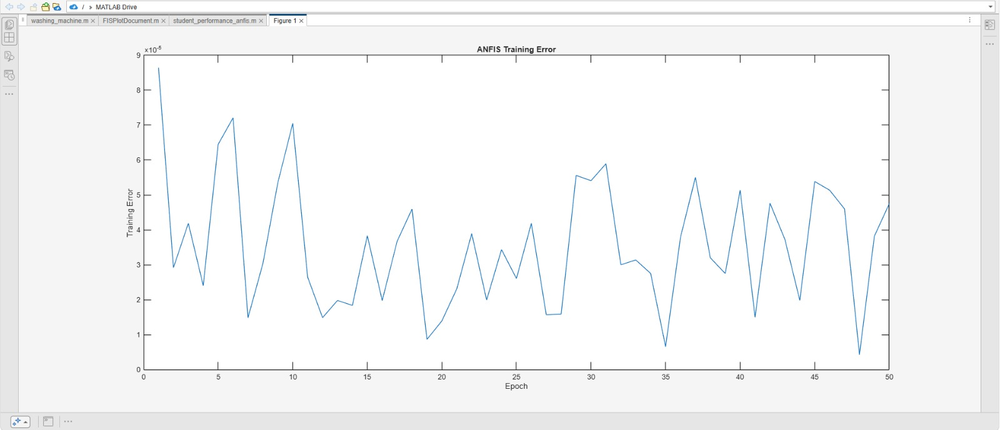

# Fuzzy Logic and Hybrid Intelligent System Project

## Q1: Washing Machine Cycle Time using Fuzzy Logic

Inputs:

* Dirt Level
* Load Size

Output:

* Cycle Time

Membership Functions:

* Dirt Level: Low, Medium, High
* Load Size: Small, Medium, Large
* Cycle Time: Short, Medium, Long

Rules Used:

1. If DirtLevel is Low and LoadSize is Small then CycleTime is Short
2. If DirtLevel is Low and LoadSize is Medium then CycleTime is Short
3. If DirtLevel is Low and LoadSize is Large then CycleTime is Medium
4. If DirtLevel is Medium and LoadSize is Small then CycleTime is Medium
5. If DirtLevel is Medium and LoadSize is Medium then CycleTime is Medium
6. If DirtLevel is Medium and LoadSize is Large then CycleTime is Long
7. If DirtLevel is High and LoadSize is Small then CycleTime is Medium
8. If DirtLevel is High and LoadSize is Medium then CycleTime is Long
9. If DirtLevel is High and LoadSize is Large then CycleTime is Long

Sample Input:

* DirtLevel = 75
* LoadSize = 8

Obtained Output:

* CycleTime ≈ 55 minutes

### Dirt Level Membership Function

### Load Size Membership Function

### Cycle Time Membership Function

### Rule Viewer Output

---

## Q2: Student Performance Prediction using ANFIS

Inputs:

* Attendance
* Assignment Marks
* Test Marks

Output:

* Performance Level

Performance Categories:

* Poor
* Average
* Good

The ANFIS model combines fuzzy rules with neural network learning. The fuzzy system provides initial rules, while the neural network adjusts the membership functions and rule parameters during training.

The fuzzy inference system is first generated using genfis1(), which creates initial fuzzy rules and membership functions. Then the anfis() function applies neural network learning to train the fuzzy system using the dataset. During training, the membership function parameters and rule weights are adjusted automatically to minimize prediction error.

Sample Training Data:

| Attendance | Assignment | Test | Performance |
| ---------- | ---------- | ---- | ----------- |
| 95         | 90         | 92   | 90          |
| 80         | 75         | 78   | 75          |
| 60         | 55         | 58   | 55          |

Training was performed for 50 epochs. The training error graph is attached below.

### ANFIS Training Error Graph

